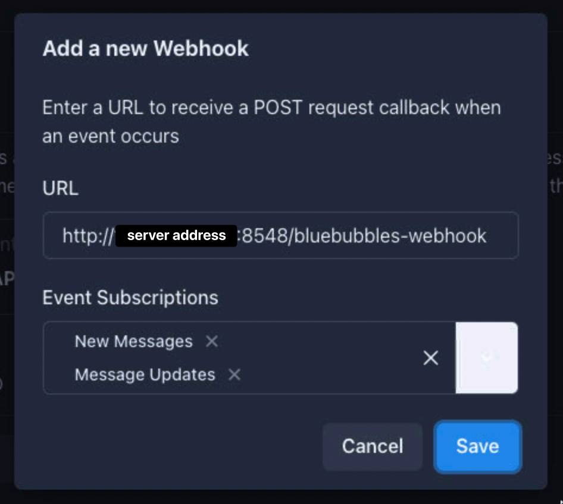

# Webhook

Track unsent iMessages.
Get notified for pending or successful Jellyseerr requests.
Receive notifications when Radarr downloads start or are completed.
Alerts when Prowlarr proxies disconnect or are restored.

## Pre-requisites
- A Maubot instance with the [Webhook plugin](https://github.com/jkhsjdhjs/maubot-webhook) installed
- A working [BlueBubbles Server](https://bluebubbles.app/downloads/server/) to track unsent messages (optional)
- A MongoDB collection (optional, only needed for tracking unsent messages)
    - You can create a free MongoDB account and configure a shared instance, or self- host.
-  Docker and Docker Compose for easier deployment
    - Alternatively, you can deploy the application manually. I will not be able to offer support for alternative deployment, but you can find instructions provided by FastAPI for [cloud deployment](https://fastapi.tiangolo.com/deployment/cloud/) or [running a server manually](https://fastapi.tiangolo.com/deployment/manually/).

## Installation
1. Set up `maubotwebhook` to use the configuration below, replacing `!roomid:homeserver.tld` with your Matrix room ID.

    ```
    path: /send
    method: POST
    room: '!roomid:homeserver.tld'
    message: '{{ json.message }}'
    message_format: plaintext
    auth_type:
    auth_token:
    force_json: true
    ignore_empty_messages: true
    ```

2. Clone the repository
    ```
    git clone https://github.com/mehapps/webhook
    ```

3. Navigate into the repository
    ```
    cd webhook
    ```

4. Create a `.env` file with:
    - `ATLAS_URI` (this should be your MongoDB connection string, and should be URL encoded)
    - `MAUBOT_URL` (this should be your base URL)
    - `BB_URL` (optional - this should be your BlueBubbles base URL, needed if you're using BlueBubbles)
    - `BB_PASSWORD` (optional - this should be your BlueBubbles password, needed if you're using BlueBubbles)
    - `AREA_CODE` (this is optional and will default to +1, only needed if you're using BlueBubbles)
    - `TIMEZONE` (this is optional and will default to America/New_York, only needed if you're using BlueBubbles)  

    Here is an example:
    ```
    AREA_CODE=+1
    ATLAS_URI=mongodb+srv:/your_url
    BB_PASSWORD=password
    BB_URL=http://127.0.0.1:1234
    MAUBOT_URL=http://127.0.0.1:29316
    TIMEZONE=America/New_York
    ```

5. Build the Docker image:
    ```
    docker compose --pull --env-file .env build .
    ```

6. Start the Docker container:
    ```
    docker compose --env-file .env up -d
    ```

7. If you're using BlueBubbles, create a new Webhook in the `API & Webhooks` section of the BlueBubbles Server settings. Enter the server address and port, followed by `bluebubbles-webhook`. Then make sure to select `New Messages` and `Message Updates`

    


## Issues & Suggestions

If you have any issues running the server or have any suggestions, feel free to create an issue and I'll do my best to help you! 